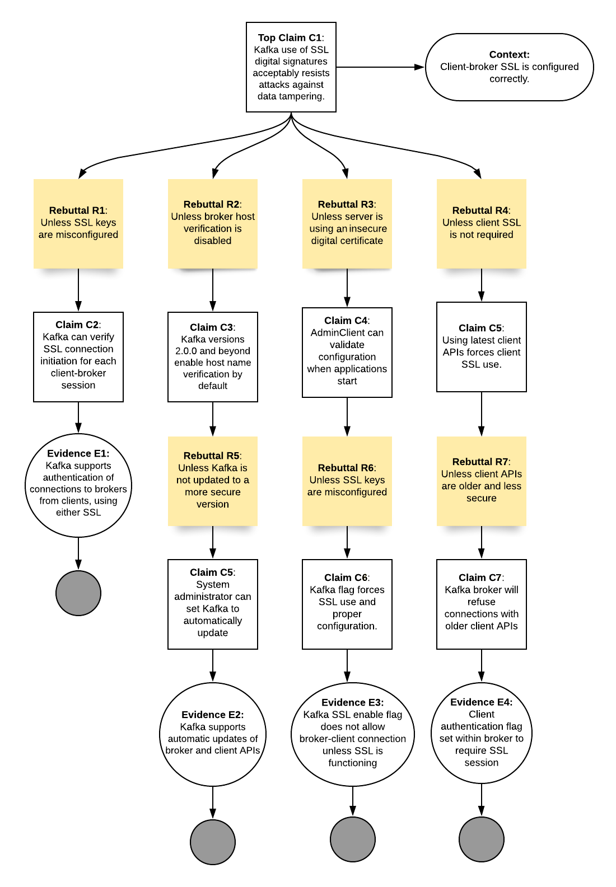
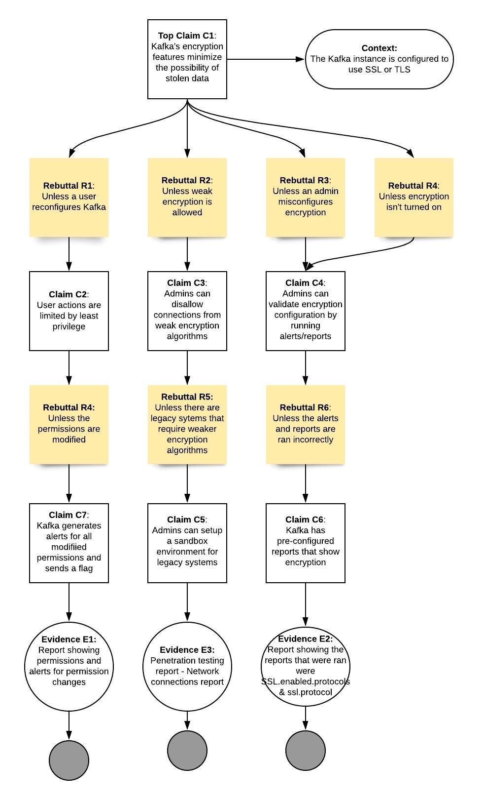

# Assurance Cases

## Assurance Case 1

### Evidence

* E1 - Assurance case 2 uses C2 as its top level claim and shows that Kafka reduces data loss via replication. Therefore, it is less likely that data will be lost before the configured retention period if replication is used. 

* E2 - Assurance case 3 uses C3 as its top level claim and shows that Kafka’s access control lists prevent unauthorized users from changing broker configurations. This makes it unlikely that a malicious user could change a broker configuration to have it drop data earlier than anticipated (after 1ms for example).

* E3 - The [AdminClient Javadoc](https://kafka.apache.org/23/javadoc/index.html?org/apache/kafka/clients/admin/AdminClient.html) indicates that AdminClient can be used to periodically check configurations while an application is running. If a broker topic’s retention time is found to be misconfigured, it can be corrected before data is written to it.

## Assurance Case 2

### Evidence

* E1 - From the [Apache Kafka documentation](https://kafka.apache.org/documentation/) we learn that "Kafka is run as a cluster on one or more servers that can span multiple datacenters." Therefore, even if an entire datacenter were to fail, data in a multi-broker cluster could still be recovered.

* E2 - The [AdminClient Javadoc](https://kafka.apache.org/23/javadoc/index.html?org/apache/kafka/clients/admin/AdminClient.html) describes itself as “The administrative client for Kafka, which supports managing and inspecting topics, brokers, configurations and ACLs.” It can be used to periodically check the multi-broker cluster configuration to ensure data is being replicated to improve fault-tolerance and prevent data loss.

* E3 - The [Apache Kafka documentation](https://kafka.apache.org/documentation/) includes a quick start tutorial for setting up a multi-broker cluster. When configuring the different brokers, the document states “We have to override the port and log directory only because we are running these all on the same machine and we want to keep the brokers from all trying to register on the same port or overwrite each other's data.” Therefore, if there’s ever an occasion where two brokers on the same machine have the same output filename, they will overwrite each others data (reducing fault-tolerance and increasing the likelihood of data loss). This problem could be circumvented if the system were to alert a user if two brokers have the same output filename.

* E4 - From section 3.3 Producer Configs in the [Apache Kafka documentation](https://kafka.apache.org/documentation/), if ‘acks’ is set to ‘all’ in the producer configuration file “…the [lead broker] will wait for the full set of in-sync replicas to acknowledge the record. This guarantees that the record will not be lost as long as at least one in-sync replica remains alive.” This prevents a situation from occurring where the lead broker fails and the most recent data written to it is lost because none of its replicas are in-sync.

## Assurance Case 3

### Evidence

* E1 - The [Apache Kafka documentation](https://kafka.apache.org/documentation/) explains that "SimpleAclAuthorizer now logs access denials to the authorizer log by default." This al   erts admins to any unauthorized user repeatedly trying to access a resource, so that they are stopped before they are successful.

* E2 - From the [Apache Kafka documentation](https://kafka.apache.org/documentation/) we learn that “By default, all principals that don't have an explicit acl that allows access for an operation to a resource are denied." So even if a resource isn’t associated with any acl, or those acls are removed, no unauthorized user can gain access to it, because every user, by default, will be considered unauthorized.

* E3 - From section 7.3 Authentication using SASL in the [Apache Kafka documentation](https://kafka.apache.org/documentation/): "[the] client section [in the JAAS file] is used to authenticate a SASL connection with zookeeper. It also allows the brokers to set SASL ACL ..." Only those with a valid certificate can alter the ACL, which makes it harder for an unauthorized user to change their permissions and access a resource.

* E4 - A report that shows user permissions and flags any changes to those permissions would notify an admin if any unauthorized user has somehow gained access to a resource, so that it can be corrected.

## Assurance Case 4

### Evidence

The first piece of evidence (E1) stems from Kafka's dynamic security settings.  System administrators can force an SSL connection between all server cluster brokers and any clients, by activating a flag that requires SSL to be enabled on both ends of the data pipeline.  This flag is set to 'false', by default, and must be activated manually.  This feature supports claim (C2) and ensures that SSL is verified for each session.
Older versions of Kafka did not require brokers to be verified using their FQDN (full qualified domain name) and IP address, which presented the threat of man-in-the-middle attacks. Newer versions do require such verification (E2), and system administrators can ensure this protection is running by setting automatic updates to broker and client Kafka APIs (C5). SSL key pairs must appropriately configured using the RSA or ECC algorithms, in order for SSL to work. Therefore, a flag is set with parameters to allow for key pair generation(C6); once this is done, Kafka will not allow a broker-client or broker-broker connection without the specified SSL connection(E3). Older client APIs did not implement SSL; the way to prevent pipelines with these older APIs is configuration of up-to-date Kafka brokers to require an SSL session or to refuse granting a session token with older client APIs (C7). This is established via a Kafka broker API flag (E4).

## Assurance Case 5

### Evidence

Evidence for C7 (E1) would include a report that would show that alerts are properly showing for any changes in user permissions and that the proper flags are sending. This report would also include a detailed list of users and the access permissions they have and if the permissions have changed since the last time the report was generated. Evidence for C5 (E3) would include a penetration test and a network connection report showing that the legacy systems are properly sandboxed and containerized. Evidence for C6 (E2) would be a log report that can be ran from kafka's pre-configured logs (ssl.enabled.protocols & ssl.protocol) that shows what versions of SSL are allowed and how they are configured. 

